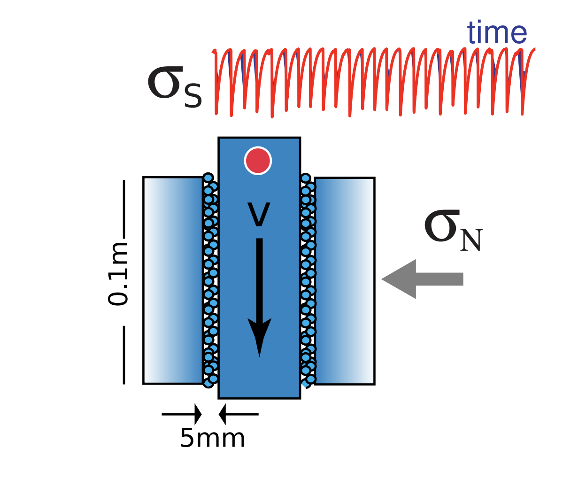
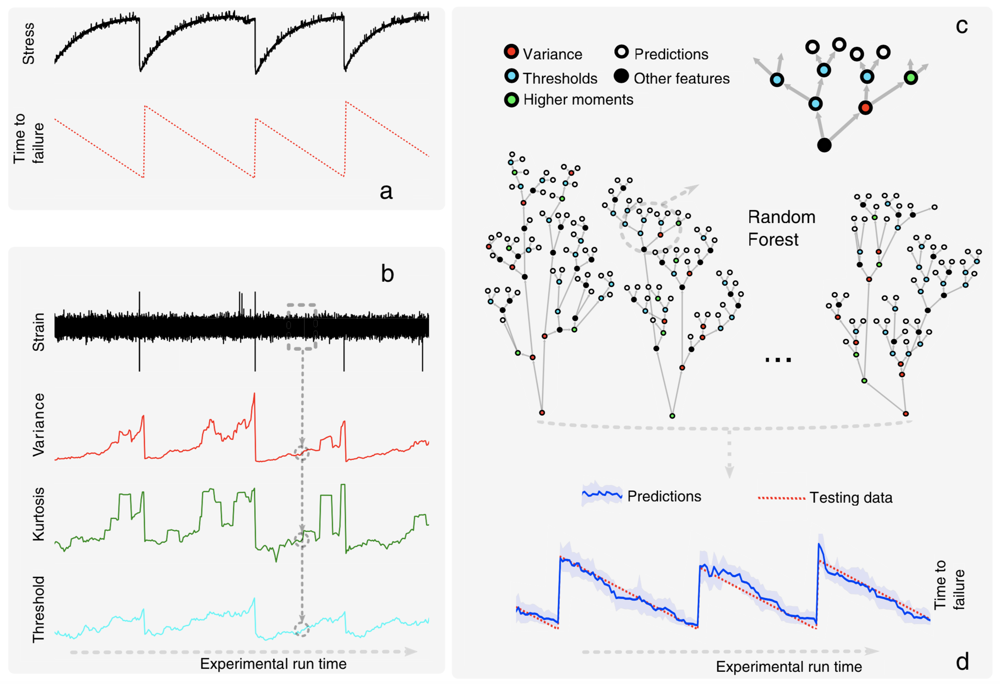
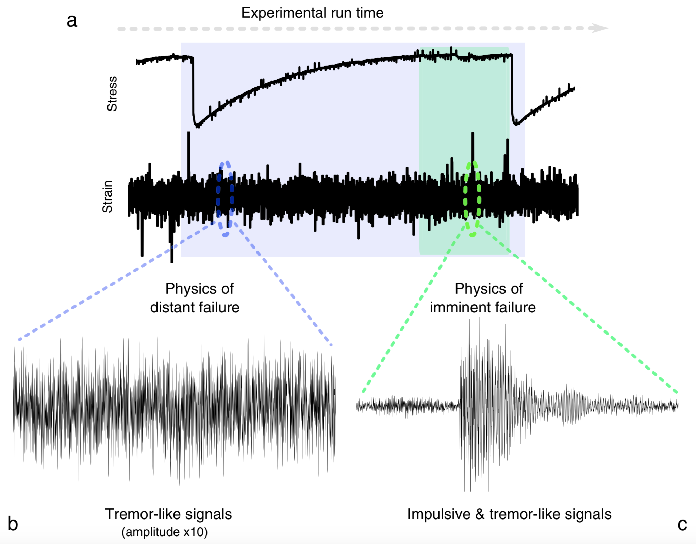

# Notes From “Machine Learning Predicts Laboratory Earthquakes” Paper

The goal is identifying hidden signals that precede earthquakes by listening to the acoustic signal emitted by a laboratory fault.

We use ML to identify telltale sounds—much like a squeaky door—that predict when a quake will occur.

Acoustic/seismic precursors to failure appear to be a nearly universal phenomenon in materials. For instance, it is well established that failure in granular materials is frequently accompanied by impulsive acoustic/seismic precursors, many of them very small. Precursors are observed in laboratory faults and are widely but not systematically observed preceding earthquakes. We posit that seismic precursor mag- nitudes can be very small and thus frequently go unrecorded or unidentified.

Laboratory system:

The driving piston displaces at a very constant velocity of 5 μm/s during the interevent time and accelerates briefly during slip. An accelerometer records the acoustic emission (AE) emanating from the shearing layers.
The rate of impulsive precursors accelerates as failure approaches.

Our goal is to predict the time remaining before the next failure (Figure 1a, bottom) using only local, moving time windows of the AE data based on statistical features derived from the time windows.

Figure 1 of the paper: part b shows acoustic emission (dynamic strain) data. The dashed rectangle represents a moving time window; each window generates a single point on each feature curve below

From each time window, we compute a set of approximately 100 potentially relevant statistical features (e.g., mean, variance, kurtosis, and autocorrelation). The most useful features are then selected recursively. The RF uses these selected features to predict the time remaining before the next failure.

Each prediction uses only the information within one single time window of the acoustic signal. Thus, by listening to the acoustic signal currently emitted by the system, we predict the time remaining before it fails—a “now” prediction based on the instantaneous physical characteristics of the system that does not make use of its history. 

We find that statistics quantifying the signal amplitude distribution (e.g., its variance and higher-order moments) are highly effective at forecasting failure. The variance, which characterizes overall signal amplitude fluctuation, is the strongest single feature early in time. As the system nears failure, other outlier statistics such as the kurtosis and thresholds become predictive as well.

Figure (3b) shows a raw time series far from failure. The signal exhibits small modulations that are challenging to identify by eye and persist throughout the stress cycle. These modulations increase in amplitude as failure is approached, as measured by the increase in signal variance.

Figure 3 of the paper

Our ML-driven analysis suggests that the system emits a small but progressively increasing amount of energy throughout the stress cycle, before abruptly releasing the accumulated energy when a slip event takes place.

Random Forest model was used for prediction. 
The fact that timing prediction can be made under conditions the RF has never seen suggests that the time series signal is capturing fundamental physics that leads to the prediction.
